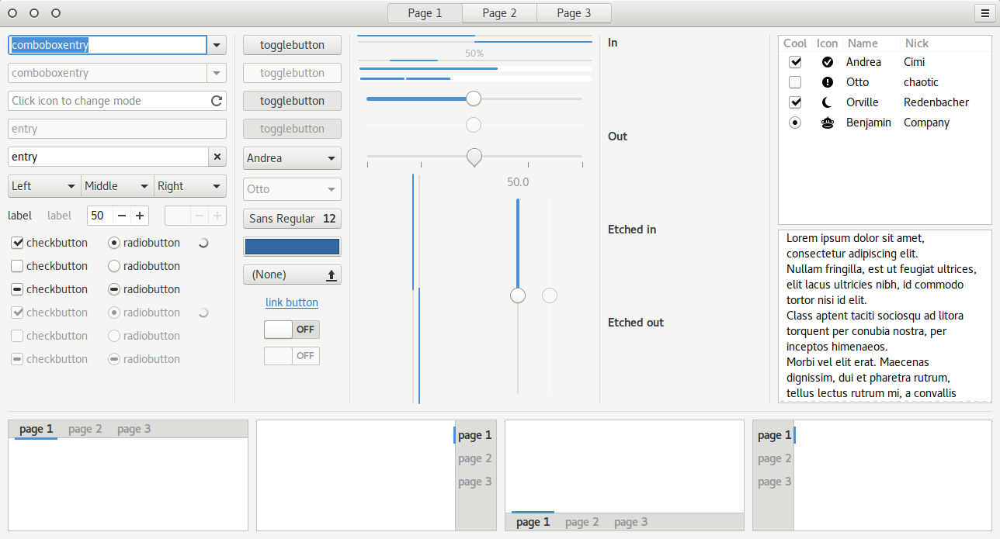
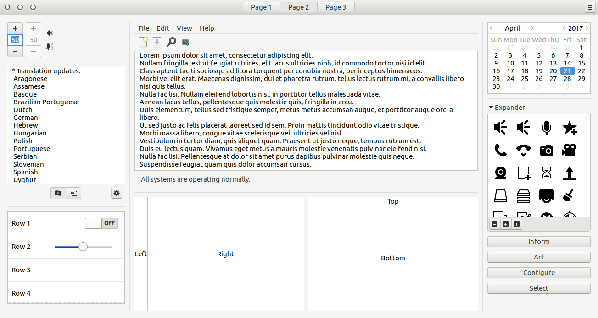
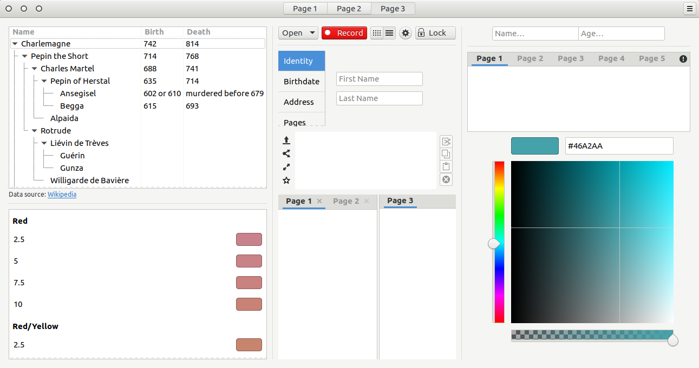
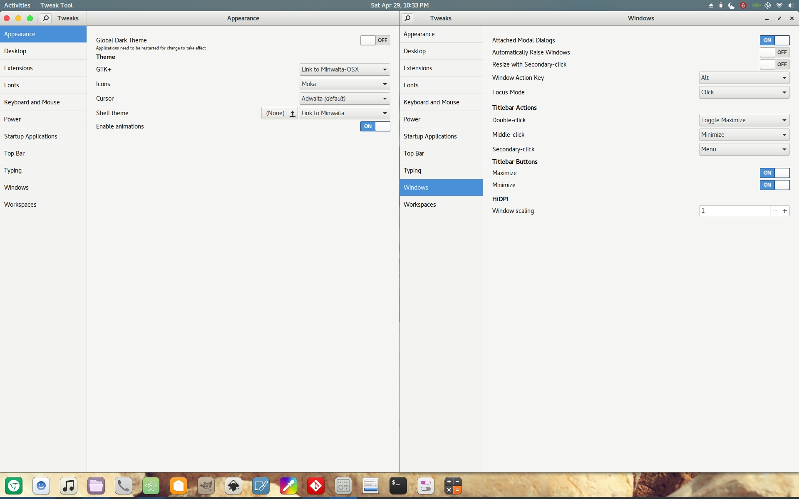

# Minwaita
Reduces excessive padding from the default GNOME, Adwaita to make it more compact. Some of the additional tweaks include: 

<ul>
<li>Window shadow being reduced to get rid of the "dirty" look Adwaita has.</li>
<li>New window buttons.</li>
<li>The appmenu icon in the topbar has been removed (with spacing accounted for)</li>
<li>The spacing in third-party indicators and the aggregate menu have been tweaked to make it all appear uniform</li>
<li>Additional Dash to Dock styling to make the dock feel more "complete"</li>
<li>A couple more tasteful design tweaks such as removing the progressbar borders all for a cleaner look</li>
</ul>

The end goal is to provide a sleaker, more streamlined GNOME experience without the need for too many extensions and additional tools.

## Preview

## Download
[Latest release here](Minwaita-Latest.tar.gz) also over at [GNOME-Look](https://www.gnome-look.org/p/1174686/).

## Original projects
- https://github.com/abihf/adwaita-compact
- https://github.com/horst3180/vertex-theme
- https://github.com/michael-rapp/gnome-shell-extension-hide-app-icon
- https://micheleg.github.io/dash-to-dock/
- https://git.gnome.org/browse/gtk+/tree/gtk/theme/Adwaita/
- https://git.gnome.org/browse/gnome-themes-standard/tree/themes/Adwaita
- https://git.gnome.org/browse/gnome-shell-sass/
